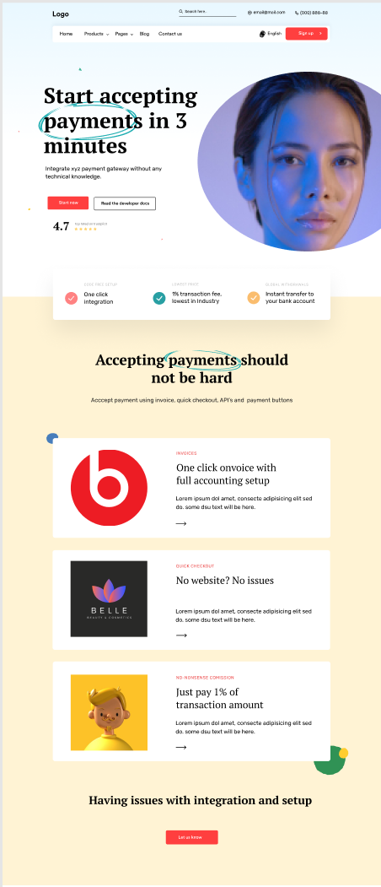

# Responsive Web Design w/ Tailwind CSS

Learning Responsive Web Design by translating the first two sections of [THIS FIGMA DESIGN](<https://www.figma.com/design/nALyBU55xz5345xg8i3MNl/Payment-gateway-business-landing-page-(Community)?node-id=0-1&t=RzkGRn9GOSIHtPMb-0>).

**NB: THIS IS THE STARTER CODE. FOR THE FINAL CODE, CHECK THE OTHER BRANCHES**

## System Requirements

- Node 18+
- A browser capable of running JavaScript (Chrome, Firefox, Safari, or Edge)
- Operating System (Windows 10+, MacOS, Linux, etc.)
- A text editor capable of running JavaScript (Visual Studio Code, Vim, Nano, Emacs, Atom, Sublime Text, etc.)
- RAM >= 4GB
- Disk space >= 1GB

## Installation

To use this repo, follow these steps:

### Alternative One

1.  Open the terminal/CLI on your computer.

2.  Clone the repository by running the following command:

        git clone https://github.com/oyieroyier/responsive-web-design.git

3.  Change directory to the repo folder:

        cd responsive-web-design

4.  Open it in your Code Editor of choice. If you use VS Code, run the command:

        code .

### Alternative Two

- On the top right corner of this page there is a button labelled `Fork`.

- Click on that button to create a copy of the repository to your own account.

- Follow the process described in `Alternative One` above.

- Remember to replace your username when cloning.

      git clone https://github.com/your-github-username-here/responsive-web-design.git

## Running the application locally

- Open the integrated terminal in your code editor and install the project dependencies:

      npm install

- Once done with the installation, run the development server in your terminal.

      npm run dev

- You should see the notification `Your application running on port 5173 is available.` at the bottom of your editor.
- If using VS Code, click the `Open in Browser` button.
- If using any other editor, copy the link in the terminal and open it on your browser.

      http://localhost:5173/

## Authors

[Bob Oyier](https://github.com/oyieroyier/)
